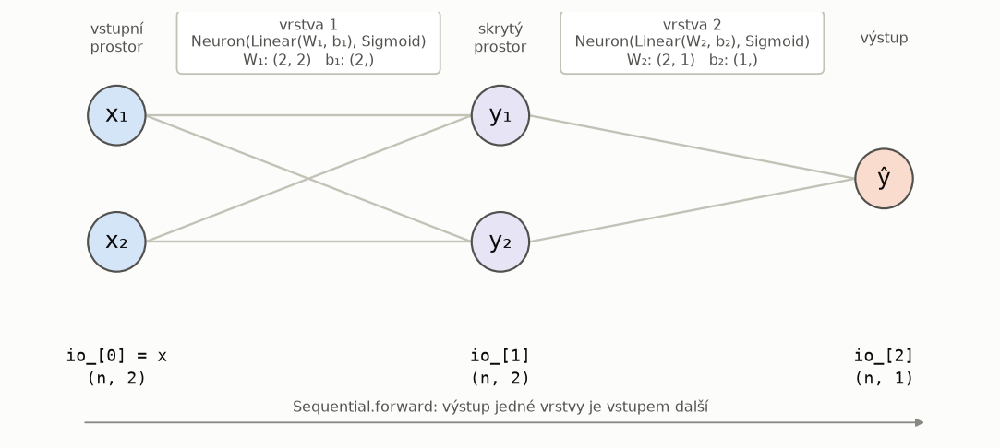
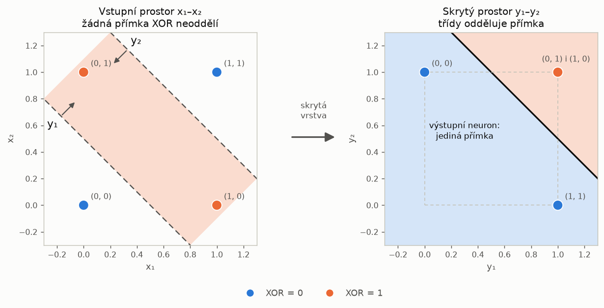
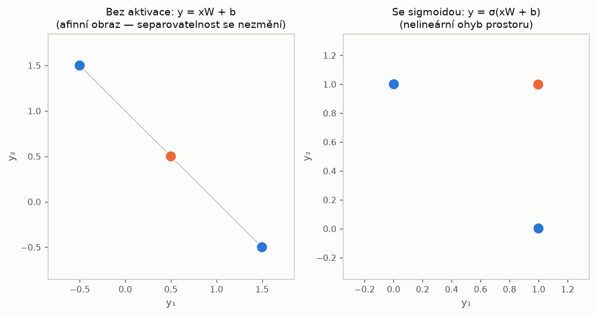
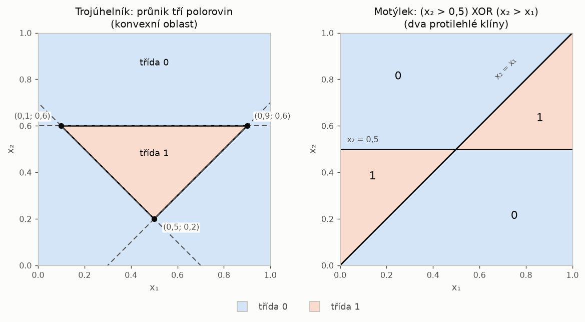
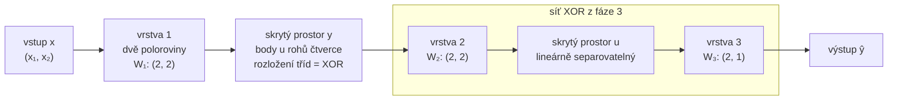

# Cvičení 9: Vícevrstvá síť — skládání vrstev a transformace prostoru

Deváté praktické cvičení předmětu **Umělá inteligence v medicíně** navazuje
přímo na Cvičení 08. Tam jsme ukázali, že jeden neuron je lineární
klasifikátor: jeho rozhodovací hranicí je nadrovina. Proto žádnou volbou
parametrů nerealizuje hradlo XOR. Nyní z téhož neuronu sestavíme **vícevrstvou
síť**: vrstvy **skládáme** za sebe a výstup jedné vrstvy se stává vstupem
další. Váhy se stále **navrhují ručně** z geometrie úlohy.

Jádrem cvičení je **transformace prostoru**. Skrytá vrstva
zobrazí body z roviny $x_1$–$x_2$ do nového prostoru příznaků $y_1$–$y_2$.
Úloha, kterou v původním prostoru nerozdělí žádná přímka, se v novém prostoru
může stát lineárně separovatelnou. Výstupní neuron pak provede jediný
lineární řez. Tento prostor lze na rozdíl od většiny obdobných konstrukcí
v kurzu přímo vykreslit, a proto je zde princip nejnázornější.

---

## Obsah

1. [Cíle cvičení](#cíle-cvičení)
2. [Struktura repozitáře](#struktura-repozitáře)
3. [Instalace a spuštění](#instalace-a-spuštění)
4. [Teoretický základ](#teoretický-základ)
5. [Konfigurace projektu](#konfigurace-projektu)
6. [Pokyny k vypracování](#pokyny-k-vypracování)
7. [Lokální testování](#lokální-testování)
8. [Doplňkové (papírové) příklady](#doplňkové-papírové-příklady)
9. [Odevzdání](#odevzdání)

---

## Cíle cvičení

Po dokončení tohoto cvičení student:

1. **Chápe vrstvu jako matici vah.** Vrstva s $k$ neurony je jediná afinní
   transformace $\mathbf{z} = \mathbf{x}W + \mathbf{b}$ s maticí $W$ tvaru
   `(n_vstupů, k)`. Sloupec $j$ matice obsahuje váhy $j$-tého neuronu, tedy
   normálu jeho rozhodovací přímky.
2. **Skládá vrstvy do sítě.** `Sequential` volá vrstvy postupně, výstup jedné
   je vstupem další. Během průchodu uchovává stopu
   `io_ = [x, out_1, out_2, …]`, ze které lze číst mezilehlé prostory.
3. **Rozumí transformaci prostoru.** Každý skrytý neuron definuje jednu
   souřadnici nového prostoru, $k$ skrytých neuronů tedy $k$-rozměrný prostor.
   Student umí vysvětlit a vykreslit, jak skrytá vrstva „narovná" XOR tak, že
   ho výstupní neuron oddělí přímkou.
4. **Ví, proč je nutná nelineární aktivace.** Složení afinních vrstev bez
   aktivace je opět afinní zobrazení a lineární separovatelnost nezmění.
   Hloubka bez nelinearity nepřidává vyjadřovací sílu.
5. **Navrhuje sítě z geometrie.** Pro XOR, konvexní oblast (trojúhelník)
   a nekonvexní oblast (motýlek) odvodí přímky, orientuje jejich normály,
   sestaví matice vah a vektory biasu a zvolí výstupní kombinaci (AND, XOR).
6. **Rozumí měřítku vah.** Vynásobení $W$ i $\mathbf{b}$ kladnou konstantou
   přímku nezmění, pouze zostří přechod sigmoidy. Je to totéž jako snížit
   teplotu. Student rozliší chybu v návrhu od příliš měkké hranice.
7. **Vidí hloubku jako skládání hotových bloků.** Síť pro motýlka vznikne tak,
   že se síť XOR z předchozí fáze nasadí na vrstvu dvou polorovin.
8. **Zasadí princip do kontextu kurzu.** „Převést data do prostoru, kde úloha
   funguje" je opakující se motiv. Skrytá vrstva je jeho nejnázornější
   instance, protože nový prostor lze přímo vykreslit.

---

## Struktura repozitáře

```
cviceni-09-template/
├── .github/
│   └── workflows/
│       └── tests.yml          # CI: po každém push spustí pytest (PŘEDVYPLNĚNO)
├── cviceni_09.py              # Pipeline, kostra PŘEDVYPLNĚNA; ÚKOL: váhy ve faze_xor/trojuhelnik/motylek
├── config.yaml                # Konfigurace (počet bodů, seed, teplota, vrcholy trojúhelníku)
├── priklady_09.md             # Papírové příklady, BEZ řešení
├── requirements.txt           # Python závislosti (zamčené verze)
├── .gitignore
├── README.md
├── docs/
│   └── img/                   # Schémata k tomuto README
├── src/
│   ├── __init__.py            # Re-exporty balíčku (neupravujte)
│   ├── activations.py         # BRÁNA z Cvičení 08: vložte své řešení
│   ├── linear.py              # BRÁNA z Cvičení 08: vložte své řešení
│   ├── neuron.py              # BRÁNA z Cvičení 08: vložte své řešení (včetně save/load)
│   └── network.py             # Sequential, ÚKOL: forward(); __init__ a __call__ předvyplněny
├── dataio/
│   ├── __init__.py            # Re-exporty balíčku (neupravujte)
│   ├── gates.py               # make_gate(): hradla AND/OR/NAND/XOR/XNOR (předvyplněno)
│   ├── data.py                # generate_points(): náhodné body v jednotkovém čtverci (předvyplněno)
│   ├── shapes.py              # inside_triangle(), inside_butterfly(): referenční oblasti (předvyplněno)
│   ├── config_manager.py      # Dataclassy + load_config + validate_config (předvyplněno)
│   └── plotting.py            # NetworkVisualizer + plot_space_transformation (předvyplněno)
├── data/                      # Prázdné, body se generují za běhu
│   └── .gitkeep
├── graphs/                    # Výstupní grafy (generují se automaticky)
│   └── .gitkeep
├── models/                    # Cílová složka Neuron.save (.npz), návaznost na Cvičení 08
│   └── .gitkeep
└── test_cviceni_09.py         # Automatické testy (pytest)
```

> **Poznámka k souborům `__init__.py`:** Každá složka s Python kódem (`src/`,
> `dataio/`) obsahuje `__init__.py`, který ji označuje jako balíček a definuje
> veřejné API. Díky tomu lze psát `from src import Sequential` místo
> `from src.network import Sequential`. **Tyto soubory neupravujte.**

> **Žádná samostatná třída `Layer`.** Vrstvou sítě je `Neuron` z Cvičení 08,
> jehož `Linear` nese **matici** vah tvaru `(n_vstupů, n_jednotek)` a
> **vektor** biasu tvaru `(n_jednotek,)`. Třída `Linear` se nemění. Maticové
> násobení `x @ weights` a sčítání s broadcastingem funguje pro jeden neuron
> i pro celou vrstvu. Váhy se do vrstvy vkládají **zvenku** (dependency
> injection). V Cvičení 10 je místo studenta dodá inicializátor a třída vrstvy
> zůstane stejná.

> **Balíček `dataio/` je předvyplněn celý** a žádný `NotImplementedError`
> v něm není. Vaše práce je v `src/network.py` (jedna metoda), ve třech fázích
> `cviceni_09.py` (návrh vah) a ve vložení brány z Cvičení 08 do `src/`.

> **Perzistence (`Neuron.save`/`load`) není novým úkolem.** Zůstává v
> `src/neuron.py` jako spojovací nit mezi cvičeními, proto repozitář obsahuje
> složku `models/`. Pipeline Cvičení 09 ji nepoužívá. `Neuron.load` z Cvičení
> 08 převádí bias funkcí `float(...)`, což je správné pro jeden neuron
> se skalárním biasem, ale ne pro vrstvu s vektorem biasu.

---

## Instalace a spuštění

### 1. Vytvoření virtuálního prostředí

```bash
python -m venv .venv
```

Aktivace (Windows):
```bash
.venv\Scripts\activate
```

Aktivace (Linux / macOS):
```bash
source .venv/bin/activate
```

### 2. Instalace závislostí

```bash
pip install -r requirements.txt
```

### 3. Spuštění

```bash
python cviceni_09.py
```

Pipeline má pět fází a **každá fáze má vlastní ošetření chyb**:

| Fáze | Úloha | Architektura | Stav |
|:---|:---|:---|:---|
| 1 | hradlo AND | 2-1 | vzorové řešení |
| 2 | hradlo OR | 2-1 | vzorové řešení |
| 3 | hradlo XOR | 2-2-1 | **ÚKOL:** návrh vah |
| 4 | trojúhelník | 2-3-1 | **ÚKOL:** návrh vah |
| 5 | motýlek | 2-2-2-1 | **ÚKOL:** návrh vah |

Dokud nejsou úkoly hotové, fáze, která narazí na nedokončenou část, skončí
hláškou `[NENI HOTOVO] Úkol: …` a pipeline **pokračuje další fází**. Nejdříve
se ozve `Sequential.forward`, po jeho doplnění brána z Cvičení 08 a u fází
3–5 navíc dosud nevyplněné matice. Pokud má vyplněná matice špatný tvar, fáze
skončí hláškou `[CHYBA NAVRHU]` s očekávaným a skutečným tvarem. Nikdy
nedostanete holý traceback.

> **Jediná výjimka je načtení konfigurace.** Nesmyslná hodnota v `config.yaml`
> ukončí pipeline hned na začátku hláškou `[CHYBA KONFIGURACE]`.

---

## Teoretický základ

### 1. Od neuronu k vrstvě: matice vah

V Cvičení 08 počítal neuron skalár $z = \mathbf{x}\cdot\mathbf{w} + b$.
Vrstvu $k$ neuronů nad týmž vstupem zapíšeme najednou. Vstup
$\mathbf{x}\in\mathbb{R}^{1\times n}$ je **řádkový** vektor (jeden řádek
matice dat), a proto

$$\mathbf{z} = \mathbf{x}\,W + \mathbf{b}, \qquad W \in \mathbb{R}^{n\times k},\quad \mathbf{b}\in\mathbb{R}^{1\times k},\quad \mathbf{z}\in\mathbb{R}^{1\times k}.$$

Složka $z_j = \sum_i x_i W_{ij} + b_j$ je přesně výstup $j$-tého neuronu:
**sloupec $j$ matice $W$ obsahuje váhy $j$-tého neuronu** a $b_j$ jeho bias.
Pro dávku $N$ vzorků (matice $X$ tvaru $N\times n$) platí $Z = XW + \mathbf{b}$
a vektor $\mathbf{b}$ se přičte ke každému řádku (broadcasting). V kódu je to
beze změny `Linear.forward` z Cvičení 08: `x @ weights + bias`.

| Objekt | Tvar | Význam |
|:---|:---|:---|
| `x` | `(N, n)` | dávka vstupů, řádek = vzorek |
| `weights` | `(n, k)` | sloupec $j$ = váhy (normála přímky) neuronu $j$ |
| `bias` | `(k,)` | bias neuronu $j$ je `bias[j]` |
| `Linear.forward(x)` | `(N, k)` | $z$ všech $k$ neuronů pro všech $N$ vzorků |
| `Neuron.forward(x)` | `(N, k)` | aktivace aplikovaná prvek po prvku |

> **Proč řádková konvence.** Knihovny (NumPy, PyTorch) ukládají data po
> řádcích. Zápis $XW$ proto odpovídá kódu `x @ weights` doslova. Učebnice
> často píší sloupcově $W\mathbf{x}$, kde je matice transponovaná. Obsah je
> stejný, liší se jen to, zda neuron odpovídá řádku, nebo sloupci.

### 2. Síť jako skládání vrstev

Vícevrstvá dopředná síť je **složení funkcí**:

$$f(\mathbf{x}) = f_L\big(\cdots f_2\big(f_1(\mathbf{x})\big)\cdots\big), \qquad f_\ell(\mathbf{h}) = \varphi\big(\mathbf{h}\,W_\ell + \mathbf{b}_\ell\big),$$

kde $\varphi$ je aktivační funkce aplikovaná prvek po prvku. Výstup vrstvy
$\ell$ je vstupem vrstvy $\ell+1$, a proto musí souhlasit tvary: počet
sloupců $W_\ell$ (jednotek vrstvy $\ell$) je roven počtu řádků $W_{\ell+1}$
(vstupů vrstvy $\ell+1$).



Třída `Sequential` toto složení realizuje. Průchodem si ukládá **stopu**

$$\texttt{io\_} = \big[\,\mathbf{x},\ \mathbf{h}^{(1)},\ \mathbf{h}^{(2)},\ \dots,\ \mathbf{h}^{(L)}\,\big], \qquad \mathbf{h}^{(\ell)} = f_\ell\big(\mathbf{h}^{(\ell-1)}\big),\ \mathbf{h}^{(0)} = \mathbf{x},$$

tedy seznam délky $1 + L$. Prvek `io_[1]` obsahuje souřadnice všech vzorků
v prostoru první skryté vrstvy a přesně ten vykresluje
`plot_space_transformation`. Jde o stejný princip jako `nn.Sequential`
v PyTorch: vrstvy jsou nezávislé stavební bloky a síť je jen jejich pořadí.

### 3. Transformace prostoru skrytou vrstvou

Skrytá vrstva s $k$ neurony zobrazuje $\mathbb{R}^n \to \mathbb{R}^k$. Každý
neuron definuje **jednu souřadnici nového prostoru**. Pro sigmoidu platí
$y_j \approx 1$ na kladné straně jeho přímky a $y_j \approx 0$ na straně
záporné. Výstupní neuron pak v prostoru $\mathbf{y}$ provede ještě jeden
lineární řez. Z toho plyne klíčové pozorování:

> **Úloha neseparovatelná v prostoru $\mathbf{x}$ může být separovatelná
> v prostoru $\mathbf{y}$.** Skrytá vrstva prostor „ohne" tak, aby výstupnímu
> neuronu stačila přímka. Celá síť je nelineární klasifikátor složený
> z lineárních řezů a nelineárních ohybů.

**XOR.** V Cvičení 08 jsme sporem dokázali, že XOR nerealizuje žádný jeden
neuron (Minsky a Papert, *Perceptrons*, 1969). Dvě vrstvy to dokážou, protože
XOR se rozloží na lineárně separovatelné části:

$$\mathrm{XOR}(x_1,x_2) = \mathrm{AND}\big(\mathrm{OR}(x_1,x_2),\ \mathrm{NAND}(x_1,x_2)\big).$$

Dva skryté neurony odpovídají dvěma rovnoběžným přímkám, které z roviny
vyříznou pás s rohy $(0,1)$ a $(1,0)$. V prostoru $y_1$–$y_2$ se oba rohy
třídy 1 zobrazí do **téhož** bodu a rohy třídy 0 do dvou jiných vrcholů
čtverce. Výstupní neuron je oddělí jedinou přímkou:



Obrázek ukazuje geometrii, nikoli čísla. Konkrétní matice vah, vektory biasu
a orientaci normál odvodíte sami (`priklady_09.md`, příklad 2). Existuje
i jiný rozklad, například $\mathrm{OR}(x_1 \wedge \neg x_2,\ \neg x_1 \wedge x_2)$,
a přímky i výsledný skrytý prostor pak vypadají jinak.

> **Zobrazení nemusí být prosté.** Rohy $(0,1)$ a $(1,0)$ splynou do jednoho
> bodu. Pro klasifikaci to nevadí, protože oba patří do stejné třídy. Skrytá
> vrstva nemá zachovat veškerou informaci o vstupu, jen informaci potřebnou
> pro rozhodnutí.

### 4. Proč je nezbytná nelineární aktivace

Kdyby vrstvy aktivaci neměly, složení dvou afinních vrstev by bylo opět
afinní:

$$\big(\mathbf{x}W_1 + \mathbf{b}_1\big)W_2 + \mathbf{b}_2 \;=\; \mathbf{x}\,\underbrace{(W_1W_2)}_{W'} \;+\; \underbrace{\mathbf{b}_1W_2 + \mathbf{b}_2}_{\mathbf{b}'}.$$

Libovolně hluboká lineární síť je tedy ekvivalentní **jedné** vrstvě.
Afinní zobrazení navíc **nemění lineární separovatelnost**. Oddělí-li třídy
v prostoru $\mathbf{y} = \mathbf{x}W + \mathbf{b}$ přímka
$\mathbf{y}\mathbf{v} + c = 0$, pak po dosazení
$\mathbf{x}(W\mathbf{v}) + (\mathbf{b}\mathbf{v} + c) = 0$ je to přímka
i v prostoru $\mathbf{x}$. Co bylo neseparovatelné v $\mathbf{x}$, zůstane
neseparovatelné v každém afinním obrazu:



Vlevo je afinní obraz rohů XOR: bod třídy 1 leží na úsečce mezi body třídy 0
a žádná přímka je neoddělí. Vpravo je tatáž vrstva se sigmoidou, jejíž
nelinearita rohy „ohne" do separovatelné polohy.

### 5. Konvexní oblasti: průnik polorovin

Jeden neuron odpovídá **polorovině**. Konvexní mnohoúhelník s $k$ stranami
je průnikem $k$ polorovin, takže ho realizuje síť se $k$ skrytými neurony
(jeden na každou stranu, normála orientovaná **dovnitř**) a výstupním
neuronem typu **AND**:

$$\hat{y} = \mathrm{Step}\Big(\textstyle\sum_{j=1}^{k} y_j + b_{\text{out}}\Big), \qquad b_{\text{out}} \in [-k,\ -(k-1)), \quad \text{střed intervalu } -\big(k-\tfrac12\big).$$

Podmínka $\sum_j y_j \ge k - \tfrac12$ je splněna právě tehdy, když jsou
všechny $y_j$ rovny jedné. Pro trojúhelník ($k=3$) je skrytý prostor
**trojrozměrný** a vnitřní body se zobrazí do okolí vrcholu $(1,1,1)$
jednotkové krychle, kde je od ostatních oddělí rovina.



> **Orientace normály.** Rovnice přímky $\mathbf{x}\mathbf{w} + b = 0$
> a $\mathbf{x}(-\mathbf{w}) - b = 0$ popisují tutéž přímku, liší se jen tím,
> která polorovina je „kladná". Správné znaménko ověříte dosazením bodu, o
> kterém víte, že leží uvnitř, například těžiště trojúhelníku.

### 6. Měřítko vah a teplota sigmoidy

Pro libovolné $k > 0$ platí

$$\sigma_T\big(k\,z\big) = \frac{1}{1+e^{-kz/T}} = \sigma_{T/k}(z), \qquad k\,z = 0 \iff z = 0.$$

Vynásobíme-li váhy **i** bias neuronu kladnou konstantou $k$, jeho přímka
se **nezmění**, ale přechod sigmoidy se zostří přesně tak, jako bychom
teplotu snížili na $T/k$. Pro $k \to \infty$ (nebo $T \to 0$) se sigmoida
blíží funkci `Step`. Návrh sítě má tedy dvě nezávislé složky: **polohu
přímek** (poměr vah a biasu) a **strmost přechodu** (jejich velikost vůči $T$).

Pipeline používá ve všech vrstvách `Sigmoid` s $T = 0{,}08$, nikoli `Step`.
Důvod je názornost. S aktivací `Step` by se každý bod zobrazil do vrcholu
jednotkové (hyper)krychle a obraz skrytého prostoru by se zúžil na několik
bodů. Sigmoida zachová spojitou polohu bodů a transformace je vidět.
Cenou je měkká hranice. Leží-li mnoho bodů blízko hranic vůči šířce přechodu
(malý trojúhelník, úzké klíny motýlka), návrh v „přirozeném" měřítku (normály
délky řádově 1) dá přesnost jen kolem 0,94–0,96, přestože jsou přímky
přesné. Chyby pak leží pouze u hranic. Pipeline to rozpozná a vypíše
`[TIP]`. Řešením je zvětšit měřítko vah, nikoli měnit přímky.

> **Výhled do Cvičení 10.** Při učení gradientním sestupem je měřítko vah
> kritické: příliš velké váhy sigmoidu saturují a gradient téměř mizí.
> Rozdíl mezi „kde je přímka" a „jak strmý je přechod" proto uvidíte znovu.

### 7. Nekonvexní oblasti a hloubka: motýlek

Motýlek je definován jako $(x_2 > 0{,}5) \oplus (x_2 > x_1)$, tedy **XOR dvou
polorovin**. Třída 1 jsou dva protilehlé klíny, které se dotýkají jen ve
společném vrcholu $(0{,}5;\ 0{,}5)$.

Jedna skrytá vrstva složená z neuronů pro tyto dvě poloroviny **nestačí**.
Ve skrytém prostoru má každý bod (pro `Step`) souřadnice
$(s_1, s_2) \in \{0,1\}^2$ a třída je $s_1 \oplus s_2$. To je znovu XOR,
který jeden výstupní neuron nerealizuje (Cvičení 08). Řešením je
**složení**: první vrstva převede rovinu na „rohy čtverce s rozložením XOR"
a na ni se nasadí celá síť XOR z fáze 3.



Síť 2-2-2-1 má stopu `io_` délky 4. Pipeline vykreslí oba přechody:
`io_[0] → io_[1]` (rovina → poloroviny) a `io_[1] → io_[2]` (XOR →
separovatelné). V rozhodovací oblasti uvidíte také, že sigmoida zaobluje
hranici u průsečíku přímek. Body tam mají $\mathbf{y} \approx (0{,}5;\ 0{,}5)$
a podsíť XOR dostává nejednoznačný vstup. Čím strmější přechod (odd. 6),
tím menší je zaoblená oblast.

> **Hloubka vs. šířka.** Univerzální aproximační věta (Cybenko, 1989;
> Hornik, Stinchcombe a White, 1989) zaručuje, že jedna skrytá vrstva
> s dostatečným počtem neuronů aproximuje libovolnou spojitou funkci na
> kompaktní množině. Potřebuje ale obecně jiné, a mnohdy mnohem početnější,
> přímky. Hloubka umožňuje **opakovaně použít** hotové bloky: síť XOR
> navrženou jednou jsme nasadili na nový vstup.

### 8. Opakující se motiv kurzu: najít prostor, kde úloha funguje

| Metoda | Nový prostor | Co v něm funguje |
|:---|:---|:---|
| spektrální shlukování (Cvičení 04) | vlastní vektory Laplaceovy matice grafu podobnosti | nekonvexní shluky se oddělí jako kompaktní skupiny |
| PCA (Cvičení 05) | hlavní komponenty | méně rozměrů při zachování většiny rozptylu |
| jádrové metody (jádrový trik, SVM) | implicitní prostor příznaků daný jádrem | lineární hranice odpovídá nelineární hranici v původním prostoru |
| **skrytá vrstva (Cvičení 09)** | **výstupy skrytých neuronů** | **výstupní neuron provede lineární řez** |

Rozdíl oproti předchozím metodám je dvojí. Transformaci zde **navrhujeme**
(v Cvičení 10 se ji síť **naučí**) a prostor lze pro malé sítě **přímo
vykreslit** (`plot_space_transformation`).

---

## Konfigurace projektu

### Soubor `config.yaml`

```yaml
data:
  n_samples: 400            # počet náhodných bodů v jednotkovém čtverci (fáze trojúhelník, motýlek)
  seed: 42                  # seed generátoru, reprodukovatelné rozložení bodů

sigmoid:
  temperature: 0.08         # teplota sigmoidy ve všech vrstvách

triangle:
  vertices: [[0.5, 0.2], [0.1, 0.6], [0.9, 0.6]]   # vrcholy trojúhelníku (x1, x2)
```

### Typovaná konfigurace (dataclassy)

```
ExperimentConfig
├── data:     DataConfig(n_samples, seed)
├── sigmoid:  SigmoidConfig(temperature)
└── triangle: TriangleConfig(vertices)
```

K hodnotám se přistupuje **přes atributy, nikdy přes klíče slovníku**:

```python
# Místo:   cfg["sigmoid"]["temperature"]   ← chyba až za běhu při překlepu
# Správně: cfg.sigmoid.temperature          ← editor odhalí překlep okamžitě
```

`validate_config()` ověří, že `n_samples >= 1`, `temperature > 0` a
`vertices` mají tvar 3 × 2. Při porušení vyhodí `ValueError` se srozumitelnou
hláškou.

> **Váhy sítí v konfiguraci nejsou.** Jejich tvar (matice) je součástí návrhu,
> proto je vyplňujete přímo ve fázích `cviceni_09.py`. Změníte-li vrcholy
> trojúhelníku, musíte váhy fáze 4 přepočítat.

---

## Pokyny k vypracování

Pracujte **v tomto pořadí**: brána → `Sequential.forward` → XOR →
trojúhelník → motýlek. Každý krok staví na předchozím a motýlek přímo
znovu použije vaši síť XOR.

### Předpoklad: brána z Cvičení 08 (`src/linear.py`, `src/activations.py`, `src/neuron.py`)

Zkopírujte do těchto tří souborů **své řešení z Cvičení 08**. Signatury jsou
totožné, proto stačí vložit těla metod. Poté ověřte, že vaše `Linear.forward`
funguje i pro vrstvu:

```
# Linear(np.eye(2), np.array([10.0, -10.0]))(np.array([[1.0, 2.0]]))
#   musí vrátit [[11.0, -8.0]]  (tvar (1, 2)).
# Assert "x.shape[1] == self.weights.shape[0]" funguje pro vektor i matici vah.
# Vektor biasu se přičte broadcastingem, nic dalšího měnit nemusíte.
```

Pokud jste výstup v Cvičení 08 zplošťovali (např. `.ravel()`), odstraňte to:
výstup vrstvy musí zůstat 2D `(N, k)`.

### Blok I: `Sequential.forward` v `src/network.py`

`__init__` (uloží `layers`, nastaví `io_ = None`) a `__call__` jsou
předvyplněné. Doplňte jedinou metodu:

```
# Sequential.forward(x):
#   1. Ověřte (assert), že self.layers není prázdný a že x je 2D pole.
#   2. self.io_ = [x]
#   3. Pro každou vrstvu v self.layers (v pořadí):
#        out = layer(self.io_[-1])
#        self.io_.append(out)
#   4. Vraťte self.io_[-1].
```

Po dokončení projdou fáze 1 a 2 (vzorová řešení AND a OR) a uloží grafy
`and_hranice.png` a `or_hranice.png`. Prohlédněte si, jak je i jediný neuron
zapsán maticově: váhy `(2, 1)` a bias `(1,)`.

### Blok II: `faze_xor` v `cviceni_09.py` (síť 2-2-1)

V bloku `UKOL` nahraďte `None` čtyřmi poli (tvary jsou uvedeny v komentářích):

```
# 1. Nakreslete čtyři rohy a zvolte dvě přímky, mezi nimiž leží právě rohy třídy 1.
# 2. Každou přímku zapište jako w1*x1 + w2*x2 + b = 0; normálu (w1, w2) orientujte
#    tak, aby na "správné" straně bylo z >= 0 (ověřte dosazením rohu).
# 3. w_hidden: normály jako SLOUPCE matice (2, 2);  b_hidden: biasy (2,).
# 4. Spočítejte (na papíře), kam se rohy zobrazí v prostoru y1-y2 (Step idealizace).
# 5. V prostoru y1-y2 najděte přímku oddělující třídy -> w_output (2, 1), b_output (1,).
```

Očekávaný výstup: přesnost 1,000 a tři grafy. `xor_hranice.png` zobrazuje
pás v rovině s čárkovanými přímkami skryté vrstvy a šipkami ke kladné straně.
`xor_skryte_jednotky.png` zobrazuje aktivaci $y_1$ a $y_2$ nad rovinou.
`xor_transformace.png` zobrazuje rohy před skrytou vrstvou a po ní.

### Blok III: `faze_trojuhelnik` v `cviceni_09.py` (síť 2-3-1)

```
# 1. Pro každou ze tří stran (dvojice vrcholů z config.yaml) sestavte rovnici přímky.
# 2. Orientujte normály DOVNITŘ (dosaďte těžiště: musí dát z > 0 pro všechny tři).
# 3. w_hidden (2, 3), b_hidden (3,): jedna strana = jeden sloupec.
# 4. Výstup = AND tří vstupů: w_output (3, 1), b_output (1,), viz teorie odd. 5.
```

Graf `trojuhelnik_transformace.png` zobrazuje skrytý prostor ve 3D. Pokud
pipeline vypíše `[TIP]` (přesnost pod 0,98 a chyby jen u hranic), přečtěte
si teorii, odd. 6, a měřítko vah upravte.

### Blok IV: `faze_motylek` v `cviceni_09.py` (síť 2-2-2-1)

```
# 1. Vrstva 1 (w_hidden_1 (2, 2), b_hidden_1 (2,)): neuron pro "x2 > 0.5" a neuron pro "x2 > x1".
# 2. Ověřte, že v prostoru y1-y2 mají čtyři klíny rozložení tříd jako hradlo XOR.
# 3. Vrstvy 2 a 3 (w_hidden_2, b_hidden_2, w_output, b_output): použijte síť XOR z Bloku II.
# 4. Porovnejte grafy motylek_transformace_1.png (x -> y) a motylek_transformace_2.png (y -> u).
```

> **Kontrola tvarů.** Pipeline vypíše tvary celé stopy, např.
> `(400, 2) -> (400, 2) -> (400, 2) -> (400, 1)` pro motýlka. Nesedí-li tvar
> některé matice, fáze skončí hláškou `[CHYBA NAVRHU]` s očekávaným tvarem.

---

## Lokální testování

Spusťte automatické testy příkazem:

```bash
python -m pytest test_cviceni_09.py -v
```

| Třída testů | Co ověřuje |
|:---|:---|
| `TestSequential` | Řetězení vrstev: známý výstup malé sítě, `len(io_) == 1 + počet vrstev`, `io_[0]` je vstup a `io_[-1]` výstup, každý mezivýstup je vstupem další vrstvy, každá vrstva proběhne právě jednou, na pořadí vrstev záleží, nový průchod přepíše stopu. Používá `DummyLayer`, takže **nezávisí** na bráně z Cvičení 08. |
| `TestVrstvaSMaticiVah` | `Neuron` s maticí vah jako vrstva: vektor biasu se přičítá po jednotkách, výstup má tvar `(N, k)` a je platným vstupem další vrstvy (vyžaduje bránu). |
| `TestDvouvrstvaSit` | Mechanika dvouvrstvé sítě na **libovolně zvolených** vahách: ručně dopočítané hodnoty skryté vrstvy i výstupu (`Step`), shoda s přímým výpočtem v `numpy` pro náhodné váhy, sigmoida s nízkou teplotou dává totéž co `Step`, výstup leží v $(0,1)$ a výstupní neuron skryté souřadnice skutečně kombinuje. Žádná konkrétní úloha cvičení se zde netestuje. |
| `TestGroundTruth` | Referenční oblasti: motýlek (protilehlé klíny, plocha 1/4), trojúhelník (těžiště uvnitř, nezávislost na pořadí vrcholů). |
| `TestGeneratorBodu` | `generate_points`: tvar, rozsah $[0,1]$, reprodukovatelnost se seedem. |
| `TestKonfigurace` | Načtení výchozí konfigurace a odmítnutí neplatných hodnot. |

Dokud nejsou příslušné části hotové, testy, které je volají, se hlásí jako
**`xfail`** (očekávané selhání na `NotImplementedError`) a sada skončí
s návratovým kódem 0. Jakmile část doplníte, stejný test začne procházet.
Návrhy vah ve fázích 3–5 testy nehodnotí, jejich správnost ukáže přesnost
a grafy z pipeline:

```bash
python cviceni_09.py
```

---

## Doplňkové (papírové) příklady

Soubor `priklady_09.md` obsahuje příklady k ručnímu výpočtu ve stejné notaci
jako kód (`x @ W + b`, sloupec = neuron):

1. ruční dopředný průchod danou sítí včetně stopy `io_`,
2. návrh sítě XOR z geometrie (intervaly přípustných biasů),
3. transformace prostoru a důkaz, že bez aktivace síť kolabuje do jedné vrstvy,
4. trojúhelník (orientace normál, výstupní AND) a vliv měřítka vah na měkkou hranici,
5. motýlek jako složení sítí,
6. tvary matic a počty parametrů, včetně sítě nad 30 příznaky datasetu Breast Cancer Wisconsin.

Čísla jsou volena tak, aby se dala spočítat na papíře. **Řešení nejsou
součástí repozitáře.**

---

## Odevzdání

Úloha se odevzdává ve **vaší kopii tohoto repozitáře** (vytvořené tlačítkem
*Use this template*). Po dokončení implementace proveďte:

```bash
git add src/linear.py src/activations.py src/neuron.py src/network.py cviceni_09.py
git commit -m "Implementace cvičení 9"
git push
```

Po každém `push` spustí workflow `.github/workflows/tests.yml` automatické
testy. Výsledek se zobrazí u commitu jako zelená fajfka (úspěch) nebo červený
křížek (neúspěch) a podrobnosti najdete v záložce **Actions**.

> **Actions je nutné jednou povolit.** V čerstvé kopii z šablony jsou GitHub
> Actions vypnuté. Otevřete záložku **Actions** a workflow povolte. Bez toho
> se po `push` nic nespustí.

> **Červený křížek hned po vytvoření kopie je v pořádku.** Šablona obsahuje
> nedokončené části, takže testy zpočátku neprocházejí. Zelená fajfka
> signalizuje dokončenou implementaci.

> **Soubory, které se neodevzdávají:** `src/__init__.py`, `dataio/` (celý
> balíček), `config.yaml`, `test_cviceni_09.py`, `requirements.txt` a
> `.github/`. Jsou předvyplněny a nemají se měnit. V `cviceni_09.py` měňte
> **pouze** bloky `UKOL` ve funkcích `faze_xor`, `faze_trojuhelnik`
> a `faze_motylek`.
